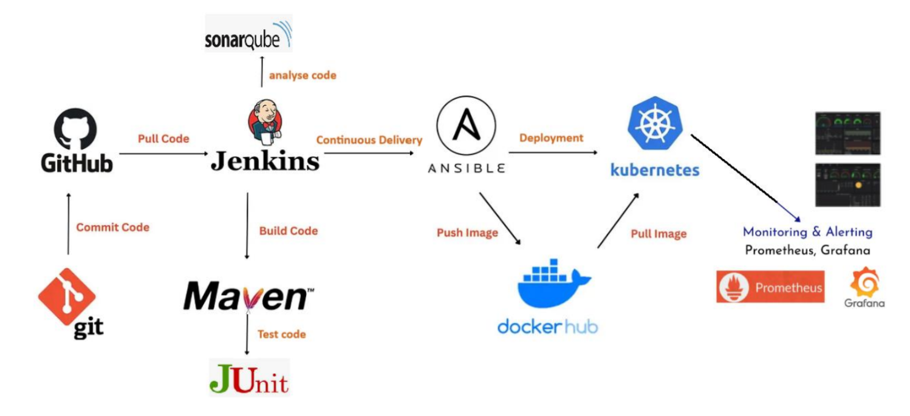

# Country Service CI/CD Pipeline

End-to-end CI/CD demo that builds, tests, analyzes and deploys a Spring Boot **country-service** REST API to **Kubernetes** using **Jenkins**, **Maven**, **Ansible** and **Docker**, with **SonarQube** for code quality and **Prometheus / Grafana** for monitoring.

> This project is meant as a learning / demo setup for a full modern pipeline.

---

## 1. High-level architecture



1. **Developer** pushes code to **GitHub**.
2. **Jenkins** pulls the code and runs a **declarative pipeline** (`Jenkinsfile`):
   - Build & test with **Maven + JUnit**.
   - Static analysis with **SonarQube**.
   - Deploy using **Ansible**.
3. **Ansible**:
   - Builds and pushes a **Docker** image.
   - Applies **Kubernetes** manifests (`deployment.yaml`, `service.yaml`).
4. A second Ansible playbook deploys:
   - **Prometheus** scraping `/actuator/prometheus` from the service.
   - **Grafana** dashboards backed by Prometheus.

---

## 2. Tech stack

**Application**

- Java 21, Spring Boot 3
- Spring Data JPA, Spring Data REST
- H2 in-memory DB (default) + optional MySQL connector
- Spring Boot Actuator + Micrometer Prometheus registry
- Lombok

**Build / Test / Quality**

- Maven
- JUnit 5, Spring Boot Test, Mockito / MockMvc tests
- SonarQube (via Jenkins stage)

**CI/CD & Ops**

- Jenkins declarative pipeline (`Jenkinsfile`)
- Docker & Docker Hub
- Kubernetes (deployment & service manifests)
- Ansible (`playbookCICD.yml`, `deploy/deploy-tomcat.yml`)
- Prometheus & Grafana (`monitoring/*.yaml`, `monitoring-playbook.yml`)

---

## 3. Project structure

```text
Pipeline-CI-main/
├── deploy/
│   └── deploy-tomcat.yml          # Optional: deploy WAR into a Tomcat container
├── docs/
│   └── images/
│       ├── image.png              # CI/CD architecture diagram
│       └── jenkins.png            # Jenkins UI screenshot (optional)
├── monitoring/
│   ├── config                     # kubeconfig for the monitoring playbook
│   ├── grafana.yaml               # Grafana deployment + service (NodePort 30300)
│   ├── monitoring-playbook.yml    # Deploy Prometheus + Grafana via Ansible
│   ├── namespace-monitoring.yaml  # "monitoring" namespace
│   └── prometheus.yaml            # Prometheus deployment + service (NodePort 30090)
├── src/
│   ├── main/
│   │   ├── java/
│   │   │   ├── application/       # Simple Calcul.java example
│   │   │   └── com/country/service/demo/
│   │   │       ├── CountryServiceApplication.java
│   │   │       ├── beans/Country.java
│   │   │       ├── controllers/CountryController.java
│   │   │       ├── repositories/CountryRepository.java
│   │   │       └── services/CountryService.java
│   │   └── resources/application.properties
│   └── test/
│       ├── java/com/country/service/demo/... (unit + integration tests)
│       └── resources/application-test.properties
├── config                         # kubeconfig used by the Ansible playbooks
├── deployment.yaml                # Kubernetes deployment for country-service
├── service.yaml                   # Kubernetes NodePort service (30007)
├── docker-compose.yml             # Run multiple instances locally with Docker Compose
├── Dockerfile                     # Build a minimal WAR image
├── Jenkinsfile                    # Jenkins declarative pipeline
├── playbookCICD.yml               # Build/push Docker image + deploy to K8s
├── pom.xml                        # Maven build configuration
└── mvnw, mvnw.cmd                 # Maven wrapper scripts
````

---

## 4. The Country Service API

The core application is a simple REST API that manages countries.

### Entity

```java
class Country {
    int    idCountry;
    String name;
    String capital;
}
```

### Default configuration

* Port: `8087`
* DB: in-memory **H2** database
* Actuator Prometheus endpoint: `/actuator/prometheus`

### REST endpoints

| Method | Path                                 | Description           |
| ------ | ------------------------------------ | --------------------- |
| GET    | `/getcountries`                      | Get all countries     |
| GET    | `/getcountries/{id}`                 | Get a country by ID   |
| GET    | `/getcountries/countryname?name=XXX` | Get a country by name |
| POST   | `/addcountry`                        | Create a country      |
| PUT    | `/updatecountry/{id}`                | Update a country      |
| DELETE | `/deletecountry/{id}`                | Delete a country      |

**Example payload**

```json
{
  "idCountry": 1,
  "name": "France",
  "capital": "Paris"
}
```

---

## 5. CI/CD Pipeline (Jenkinsfile)

The `Jenkinsfile` defines a declarative pipeline with the following stages:

1. **Checkout code**
   Pulls the `main` branch from the GitHub repository.

2. **Build & Tests (Maven)**

   ```bash
   mvn clean verify
   ```

   Runs all unit and integration tests.

3. **SonarQube Analysis**
   Uses `withSonarQubeEnv('MySonar')` and a `SONAR_TOKEN` Jenkins credential to run:

   ```bash
   mvn sonar:sonar \
     -Dsonar.projectKey=country-service \
     -Dsonar.projectName=country-service \
     -Dsonar.host.url=${SONAR_HOST_URL} \
     -Dsonar.login=${SONAR_TOKEN}
   ```

4. **Deploy using Ansible playbook**
   Executes `playbookCICD.yml` to:

   * Log in to Docker registry.
   * Build the Docker image from the `Dockerfile`.
   * Push the image.
   * Apply `deployment.yaml` and `service.yaml` to the Kubernetes cluster (namespace `jenkins`).

5. **Deploy Monitoring (Prometheus & Grafana)**
   Runs `monitoring/monitoring-playbook.yml` to deploy Prometheus and Grafana in the `monitoring` namespace.

6. **Post actions**

   * Always clean the Jenkins workspace.
   * Log success or failure messages.

---

## 6. Running locally

### 6.1 Prerequisites

* Java 21
* Maven (or use the Maven wrapper `./mvnw`)
* Docker (for Docker image / compose usage)

### 6.2 Run with Maven (H2 database)

```bash
# from project root
./mvnw clean package

# Run the generated WAR
java -jar target/country.service-0.0.1-SNAPSHOT.war
```

The API will be available at `http://localhost:8087`.

### 6.3 Run with Docker

Build and run a single container:

```bash
./mvnw clean package
docker build -t my-country-service .
docker run -p 8087:8087 my-country-service
```

Or use the provided `docker-compose.yml` to run multiple instances:

```bash
docker-compose up --build
```

* `country-service1` → `http://localhost:8087`
* `country-service2` → `http://localhost:8088`

---

## 7. Deploying to Kubernetes with Ansible

### 7.1 Prerequisites

* A Kubernetes cluster (e.g. Docker Desktop, Kind, Minikube…)
* `kubectl` configured and working
* Ansible with `community.general` and `kubernetes.core` collections
* `config` file in the repo pointing to your cluster (kubeconfig)

### 7.2 Customize the playbook

In `playbookCICD.yml`, change:

* `image_name` / `image_tag`
* Docker registry username / password
  (Ideally pass them as Ansible `--extra-vars` or via Jenkins credentials.)

### 7.3 Run the playbook manually (optional)

```bash
ansible-playbook -i localhost, playbookCICD.yml
```

This will:

1. Build and push the Docker image.
2. Apply `deployment.yaml` (3 replicas) and `service.yaml` (NodePort `30007`).

Access the service at:

```text
http://<node-ip>:30007
```

---

## 8. Monitoring with Prometheus & Grafana

The monitoring stack is defined under `monitoring/`.

```bash
ansible-playbook -i localhost, monitoring/monitoring-playbook.yml
```
```
```

